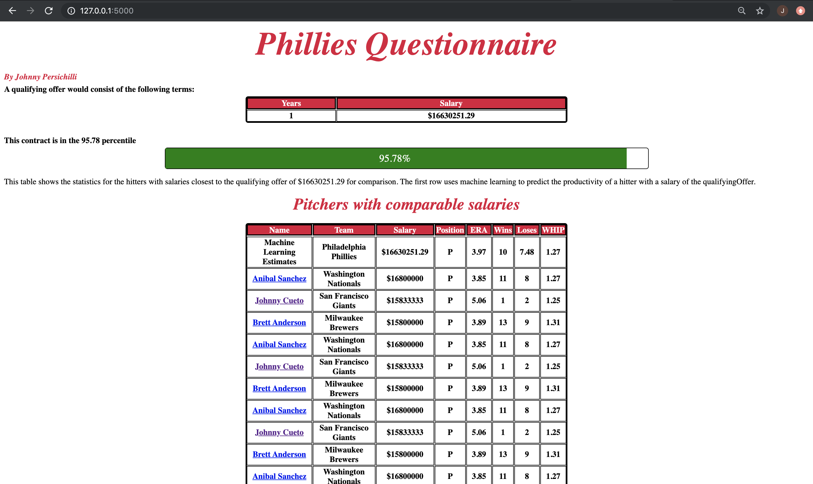
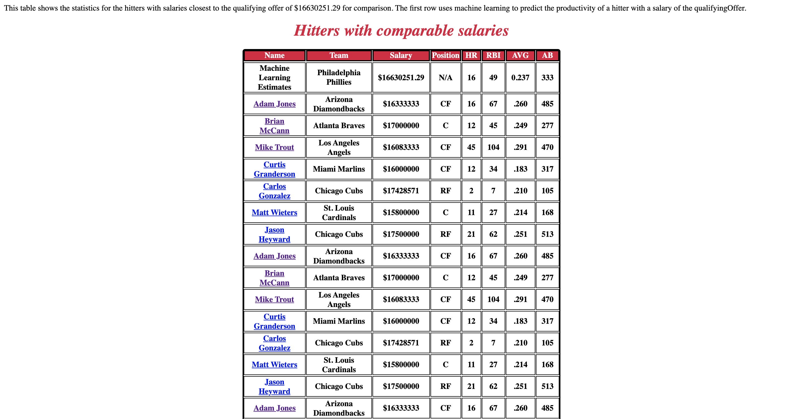
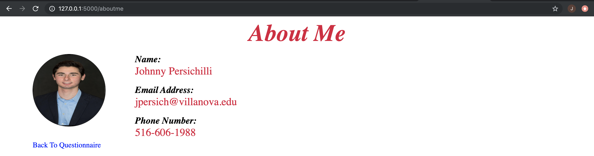

# Philadelphia Phillies Software Engineering Internship Questionnaire

  The file for my submission to the Philedelpia Phillies Software Engineering Internship
  
---
## Table of Contents
- [Description](#description)
- [Technology Used](#technology-used)
- [How to Use](#how-to-use)
- [References](#references)
- [File List and Uses](#file-list-and-uses)
- [License and Copyright](#license-and-copyright)
- [Author Info](#author-info)
--- 
## Description

This project contains my answer to both questions on the Software Engineering Internship application for the Philadelphia Phillies.   The first question answers a question about an inefficent application of a palindrome function. In the file /PhilliesQuestionnaire/PhilliesQuestion1.pdf I explain why this code is inefficient and how it can be improved.  Using these insights, the code for an improved palindrone function is located in "Question1.py"  .  The second questions uses a provided data set of MLB salaries over the past year to create a website that determines and displays the minimum salary of a qualifying offer to a restricted free agent.  All of the remaining files in the project are related to the manipulation and presentation of this data.

---
## Technology Used
- Python
- Flask
- HTML5
- CSS
- Pandas - Used for data manipulation and encapsulation
- SciPy
- BeautifulSoup - Used to scrape website provided by in the questionnaire
- requests
- statsapi - MLB stats api that provides id's and stats for various players
- sklearn - Machine learning module used for linear regression and calculation of predicted stats for player with the salary of a qualifying offer
- webbrowser - opens mlb.com after clicking on a given player


## How To Use
#### Installation and Imports
- Must first have Python installed. Depending on the version of python you may use "python" "py" "pip" or "pip3" for the following commands. An example is
```
py -m pip install flask
python -m pip install flask
pip install flask
pip3 install flask
```
https://www.python.org/downloads/
- Must install pip by downloading the get-pip.py file attached.  The go the directory where you installed pip and run the following command to download pip.
```
py get-pip.py
```
- Must install Flask-
```py -m pip install flask```
- Must install SciPy-
```py -m pip install scipy```
- Must install Pandas-
```py -m pip install pandas```
- Must install lmxl-
```py -m pip install lmxl```
If there is an error with this, download the corrent lmxl file for your computer typeform above or if it is not there go to https://www.lfd.uci.edu/~gohlke/pythonlibs/#lxml download the corresponding file and then run the command:
```py -m pip install <filename>```

To intall these dependecies you must cd into the directory where the app.py file is and type the install commands above.

#### Running the Web Application
Once in the PhilliesQuestionnaire-master\PhilliesInternshipQuestionaire directory, use the previously installed version of python to run the application using the following command.
```
flask run
```
or
```
python app.py
```
This will run the application on localhost:5000 so you must open your desired web browser and go to localhost:5000

---

## Screenshots
Screenshot of web applicaiton with stats of pitchers with a comparable salary, predicted production derived from machine learning for a pitcher with the given salary, the qualifying offer calculation, and percentile of the league in which this contract would place the player.


Screenshot with stats of hitters with a comparable salary and predicted production derived from machine learning for a hitter with the given salary.


Simple about me page.


## References
- ReadMe references: https://www.youtube.com/watch?v=eVGEea7adDM . This resource was used to learn about the format of writing a ReadMe.
- Pandas: https://medium.com/@ageitgey/quick-tip-the-easiest-way-to-grab-data-out-of-a-web-page-in-python-7153cecfca58 . This article was used to learn about the basics of data scrapping with pandas.

- SciPy(Stats and Percentiles): https://stackoverflow.com/questions/12414043/map-each-list-value-to-its-corresponding-percentile . This stackoverflow question was used as the basis for my decision to get the percentile of a players salary in relation to other MLB players
--- 
## File List and Uses
- PhilliesQuestion1.pdf : A pdf describing why a given  palindrone function was inefficent and how to improve it.
- /screenshots : Folder containing screenshot of various pages on the web application
- Question1.py : The python code for a efficent palindrome function.
- app.py : The main file that is tasked with running the index and aboutme pages of the web application. Includes the helper functions for processing the data and determining the salary for a qualifying offer.
- static/aboutme.css : contains the styling for the aboutme page of the web application
- static/mainstyle.css : contains the styling for the main page of the web application
- static/images/.. contains the image files for the project
--- 
## License and Copyright
The MIT License (MIT)

Copyright (c) 2018 John Persichilli

Permission is hereby granted, free of charge, to any person obtaining a copy of this software and associated documentation files (the "Software"), to deal in the Software without restriction, including without limitation the rights to use, copy, modify, merge, publish, distribute, sublicense, and/or sell copies of the Software, and to permit persons to whom the Software is furnished to do so, subject to the following conditions:

The above copyright notice and this permission notice shall be included in all copies or substantial portions of the Software.

THE SOFTWARE IS PROVIDED "AS IS", WITHOUT WARRANTY OF ANY KIND, EXPRESS OR IMPLIED, INCLUDING BUT NOT LIMITED TO THE WARRANTIES OF MERCHANTABILITY, FITNESS FOR A PARTICULAR PURPOSE AND NONINFRINGEMENT. IN NO EVENT SHALL THE AUTHORS OR COPYRIGHT HOLDERS BE LIABLE FOR ANY CLAIM, DAMAGES OR OTHER LIABILITY, WHETHER IN AN ACTION OF CONTRACT, TORT OR OTHERWISE, ARISING FROM, OUT OF OR IN CONNECTION WITH THE SOFTWARE OR THE USE OR OTHER DEALINGS IN THE SOFTWARE.

---
## Author Info
John Persichilli \
jpersich@villanova.edu \
Villanova University Computer Engineering 2020'
